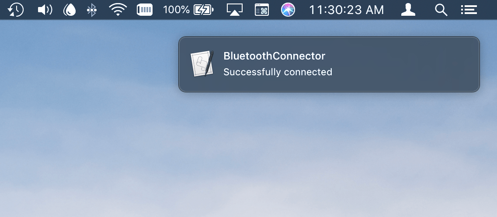
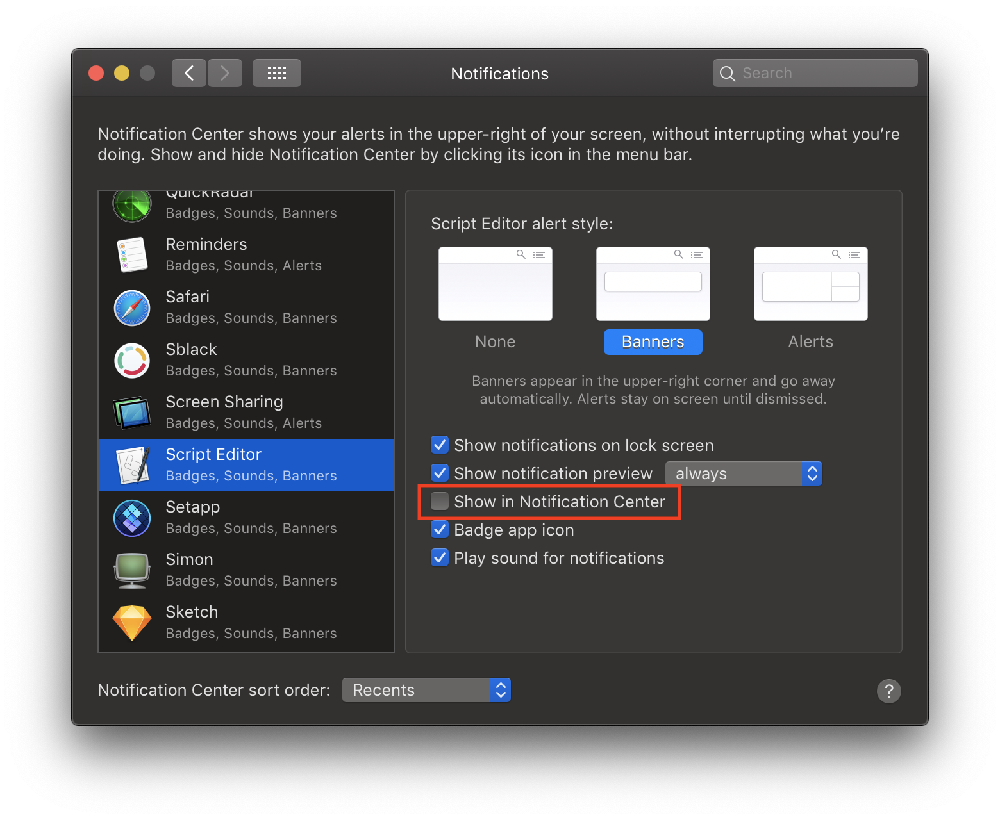

# BluetoothConnector
Simple macOS CLI to connect/disconnect a Bluetooth device.

You can download a compiled version here: https://github.com/planecore/BluetoothConnector/releases

If you have issues running the compiled binary (`permission denied` error), try running this command in Terminal:
`chmod +x /path/to/BluetoothConnector`

# Installation

### Manually
```
swift package update
swift build -c release
mv .build/release/BluetoothConnector /usr/local/bin/BluetoothConnector
```

# Usage
#### Running
Replace `00-00-00-00-00-00` with your device's MAC address or your device name. You can get the MAC address by alt-clicking the Bluetooth menu icon or by running BluetoothConnector without any arguments

##### To toggle the connection (connect/disconnect) and be notified about it
```
BluetoothConnector 00-00-00-00-00-00 --notify
```

##### To connect and be notified about it
```
BluetoothConnector --connect 00-00-00-00-00-00 --notify
BluetoothConnector -c 00-00-00-00-00-00 --notify
```

##### To disconnect
```
BluetoothConnector --disconnect 00-00-00-00-00-00
BluetoothConnector -d 00-00-00-00-00-00
```

##### Notification Center


You can have BluetoothConnector send a notification to say what it did (connect or disconnect), if the action succeeded or get an error description if something goes wrong

```
BluetoothConnector 00-00-00-00-00-00 --notify
```

To reduce Notification Center pollution, I'd recommend turning off "Show in Notification Center" for the Script Editor app in the Notifications system preferences:


